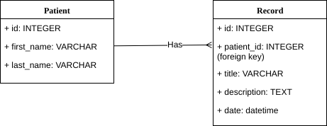

# Code 301 Final Project "Med Words" (version 1.0.0)

**Team Members** - Aaron Frank, Jeff Weng, Kendra Ellis, Tre Cain

**Deployed Site**: (http://medwords.info/)

>### Project Description
insert description

>### Problem Domain
Electronic Medical Records, Patient History Information Transfer, Knowledge Extraction, Natural Language Processing

>### Requirements
* Node.js
* dotenv: 6.0.0
* ejs: 2.6.1
* express: 4.16.3
* method-override: 3.0.0
* pg: 7.4.3
* superagent: 4.0.0-beta.5
* API key for Microsoft Text Analytics

>### How To Use Our App
Development: Create a Node instance and clone the repo.
As a User: Navigate to (http://medwords.info/), select a patient or create a new patient, create or view a patient's records, send those records off for key phrase analysis and view the key phrases.

>### Database Schema


>### Site Endpoints
* **GET /** - This route redirects the user to the '/patient' main page
* **GET /about** - This route renders the About page
* **GET /patient/:patientId** - This route queries the site DB for the patient's demographic info and records. It then renders the Patient Detail Page with the information retrieved from the DB.
* **GET /record/:patientId/:recordId** -  This route queries the database for a specific record's details and renderst the Record Detail Page.
* **GET /patient/:patientId/analyze** - This route sends a POST request to the MSFT Text Analytics Key Phrases API with all of a patient's record title+descriptions. After retrieving the key phrases, it counts the occurrences of each phrase and renders the Key Phrases page.
* **POST /patient** - Inserts a new patient to database and redirects to new patient detail page with a success message.
* **POST /record** - Inserts a new record into the database with the current date and redirects to new record detail page with a success message.
* **DELETE /patient/:patientId** - This route will delete a patient and their records from the database and redirect to the main page with a success message.
* **DELETE /record/:recordId** - This route will delete a record from the database and redirect to the patient detail page with a success message.

>### Microsoft Text Analytics Key Phrases API (requires key)
* **POST /westus.api.cognitive.microsoft.comtext/analytics/v2.0/** - 
Include a header:  'Ocp-Apim-Subscription-Key' = YOUR_KEY

Post body should be formatted as follows: 
```
{ 'documents': [
    { 'id': '1', 'language': 'en', 'text': 'I really enjoy the new XBox One S. It has a clean look, it has 4K/HDR resolution and it is affordable.' },
    { 'id': '2', 'language': 'es', 'text': 'Si usted quiere comunicarse con Carlos, usted debe de llamarlo a su telefono movil. Carlos es muy responsable, pero necesita recibir una notificacion si hay algun problema.' },
    { 'id': '3', 'language': 'en', 'text': 'The Grand Hotel is a new hotel in the center of Seattle. It earned 5 stars in my review, and has the classiest decor I\'ve ever seen.' }
]};
```

Example response:
```
{
   "documents": [
      {
         "keyPhrases": [
            "HDR resolution",
            "new XBox",
            "clean look"
         ],
         "id": "1"
      },
      {
         "keyPhrases": [
            "Carlos",
            "notificacion",
            "algun problema",
            "telefono movil"
         ],
         "id": "2"
      },
      {
         "keyPhrases": [
            "new hotel",
            "Grand Hotel",
            "review",
            "center of Seattle",
            "classiest decor",
            "stars"
         ],
         "id": "3"
      }
   ],
   "errors": [  ]
}
```


More detailed information about the API can be found here: (https://docs.microsoft.com/en-us/azure/cognitive-services/text-analytics/quickstarts/nodejs)

>### Credits and Collaborations
Microsoft Text Analytics Key Phrases API
